# Catching Fraud Before It Costs You: Building a Dual-Stream Fraud Detection System

*How we combined behavioral features, geolocation intelligence, and explainable machine learning to detect fraud in e-commerce and banking transactions at Adey Innovations Inc.*

---

Fraud detection is a balancing act. Flag too aggressively and you frustrate loyal customers with declined purchases and verification hoops — every false positive erodes trust. Flag too timidly and fraud slips through, turning directly into chargebacks and financial loss. In this project we built and compared machine-learning models for **two very different transaction streams**, evaluated them with metrics that actually matter for imbalanced data, and used SHAP to turn black-box predictions into business decisions.

**The two datasets:**

- **E-commerce transactions** (`Fraud_Data.csv`) — 151,112 purchases with rich context: signup time, purchase time, device ID, browser, traffic source, and IP address. About **9.4% fraud**.
- **Bank credit-card transactions** (`creditcard.csv`) — 283,726 transactions with PCA-anonymized features (V1–V28), amount, and time. Just **0.17% fraud** — roughly 1 in 600.

Everything below is reproducible: cleaning, geolocation enrichment, feature engineering, resampling, modeling, and explainability live in a tested `src/` package, with thin notebooks orchestrating each stage.

---

## Part 1 — Understanding the Data

### The imbalance problem, visualized

The first thing any fraud modeler must confront is class imbalance. A model that predicts "legitimate" for every single transaction would score 90.6% accuracy on the e-commerce data and 99.8% on the credit-card data — while catching **zero fraud**. This is why accuracy is banned from this report; we use **AUC-PR** (area under the precision-recall curve) and **F1** instead.

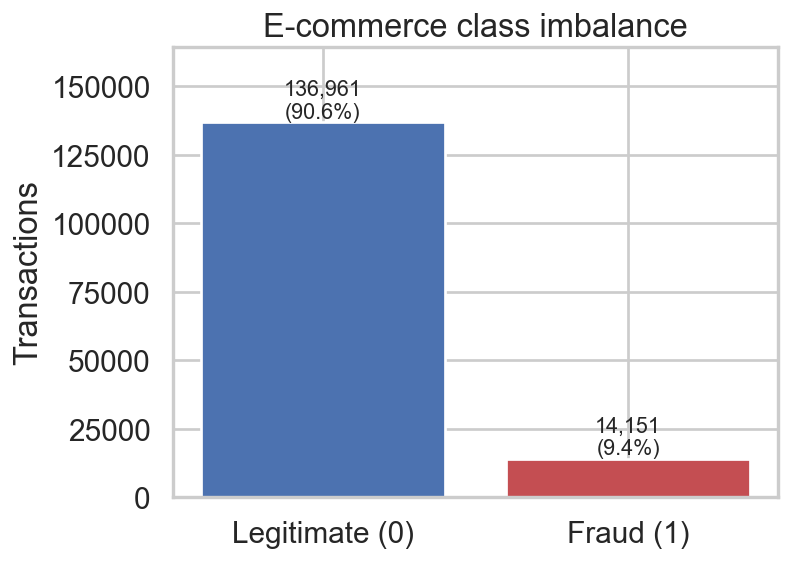

*E-commerce: 136,961 legitimate vs 14,151 fraudulent transactions (9.4%).*

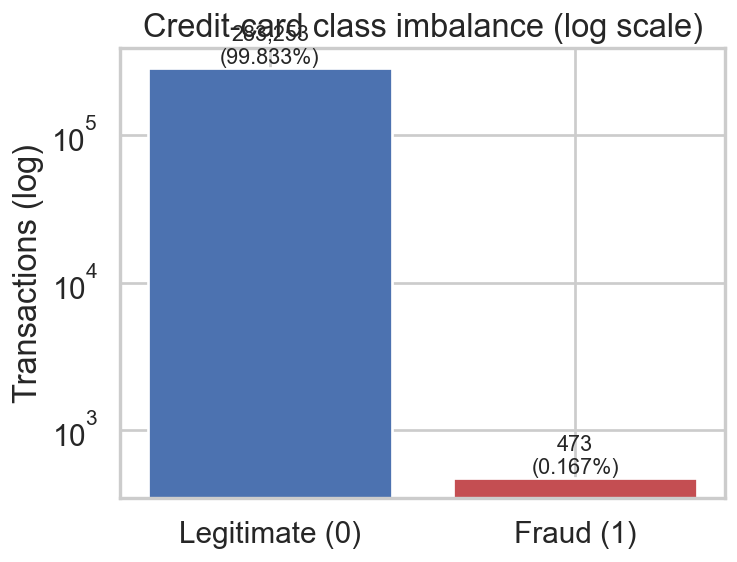

*Credit card: only 473 frauds among 283,726 transactions — note the log scale.*

### What do the raw features look like?

Purchase values and customer ages follow unremarkable right-skewed and roughly normal shapes — nothing here separates fraud on its own.

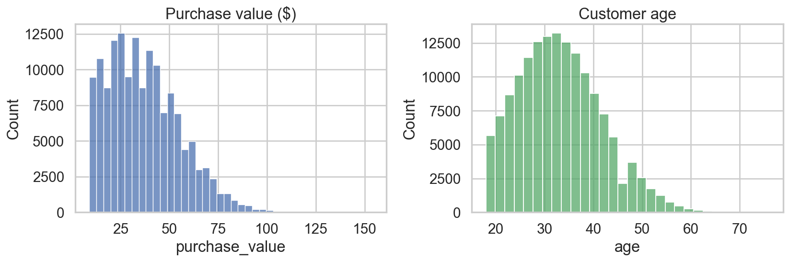

Credit-card fraud amounts are not dramatically different from legitimate amounts either — fraudsters deliberately blend in:

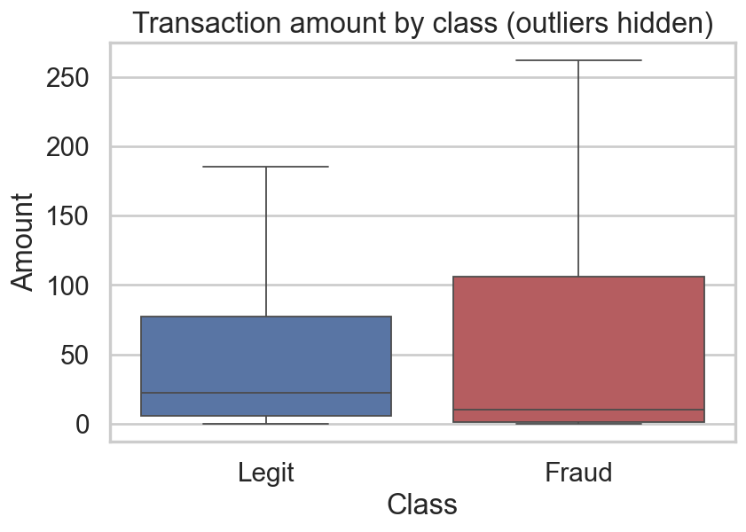

### The smoking gun: time since signup

The most striking pattern in the e-commerce data appears when we engineer `time_since_signup` — the gap between account creation and purchase. A huge share of fraudulent purchases happen **almost immediately after signup**, while legitimate customers browse, compare, and come back later.

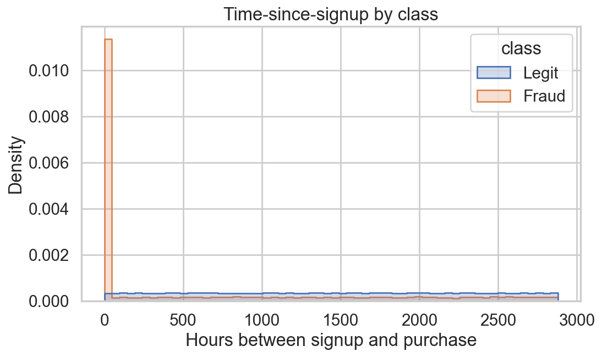

*Fraudulent purchases (orange) cluster at near-zero hours after signup. This single engineered feature becomes one of the model's strongest signals.*

### Where is fraud coming from? Geolocation enrichment

The raw data only has numeric IP addresses. We converted them to integers and merged against 138,846 IP ranges in `IpAddress_to_Country.csv` using a vectorized `searchsorted` range lookup (no slow row-by-row loops). Fraud rates vary meaningfully by country:

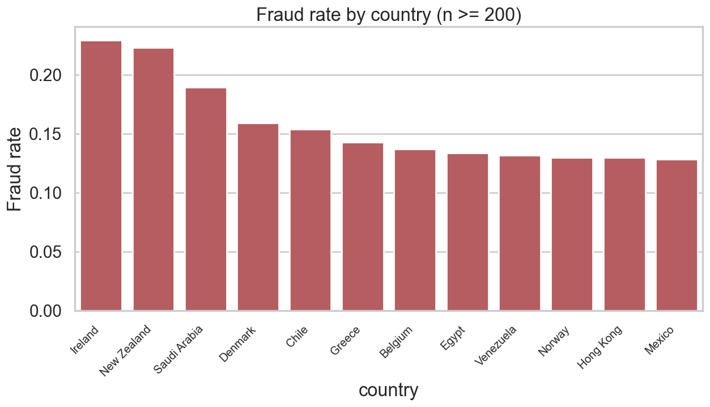

*Country becomes a useful risk feature — some origins show fraud rates well above the 9.4% baseline.*

### Feature engineering summary

| Feature | What it captures |
|---|---|
| `time_since_signup` | Seconds between signup and purchase — new-account fraud |
| `device_tx_count` | Transactions sharing one device — device farming |
| `user_tx_count`, `user_tx_velocity` | Per-user volume and speed |
| `hour_of_day`, `day_of_week` | Temporal habits of fraudsters vs customers |
| `country` | Geolocation risk from IP range lookup |

---

## Part 2 — Modeling on Imbalanced Data

### Handling the imbalance: SMOTE, on the training set only

We used **SMOTE** (Synthetic Minority Over-sampling Technique) rather than undersampling. Undersampling would throw away tens of thousands of legitimate transactions that help calibrate the decision boundary; SMOTE instead synthesizes minority-class examples in feature space. Critically, resampling happens **after** the stratified train-test split and **only on the training set** — the test set remains an honest picture of production reality.

| Stage | Legitimate | Fraud |
|---|---|---|
| Training set, before SMOTE | 109,568 (90.6%) | 11,321 (9.4%) |
| Training set, after SMOTE | 109,568 (50%) | 109,568 (50%) |
| Test set | untouched | untouched |

### Baseline vs ensemble

We trained an interpretable **Logistic Regression** baseline and an **XGBoost** ensemble (with `scale_pos_weight` and tuned `n_estimators` / `max_depth`) on both streams.

**E-commerce results (held-out test set):**

| Model | AUC-PR | F1 | Precision | Recall | ROC-AUC |
|---|---|---|---|---|---|
| Logistic Regression | 0.663 | 0.621 | 0.584 | 0.664 | 0.839 |
| **XGBoost** | **0.713** | **0.686** | **0.941** | 0.540 | **0.841** |

**Credit card results (held-out test set):**

| Model | AUC-PR | F1 | Precision | Recall | ROC-AUC |
|---|---|---|---|---|---|
| Logistic Regression | 0.516 | 0.093 | 0.049 | 0.750 | 0.851 |
| **XGBoost** | **0.761** | **0.778** | **0.808** | 0.750 | **0.959** |

The credit-card comparison is dramatic: Logistic Regression catches the same number of frauds as XGBoost (21 of 28) but raises **404 false alarms** to do it. XGBoost raises just **5**. In customer-experience terms, that is 399 legitimate cardholders per test window who are *not* wrongly blocked.

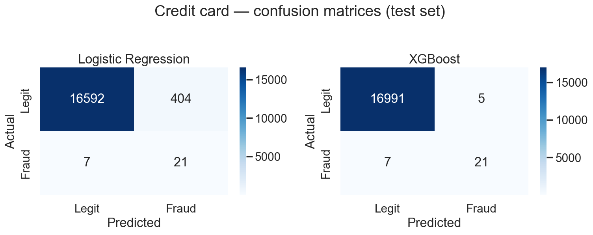

The e-commerce confusion matrices tell a similar story — XGBoost trades some recall for a precision of 94%, meaning when it flags a transaction, it is almost always right:

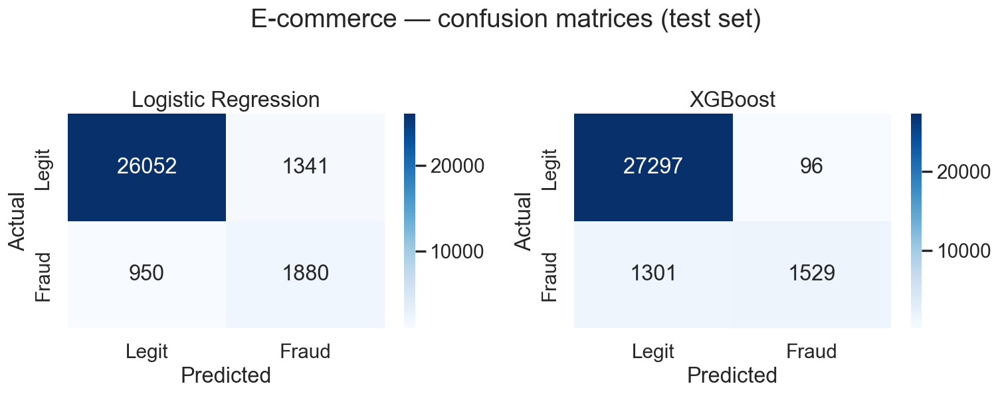

Precision-recall curves confirm XGBoost dominates across operating thresholds:

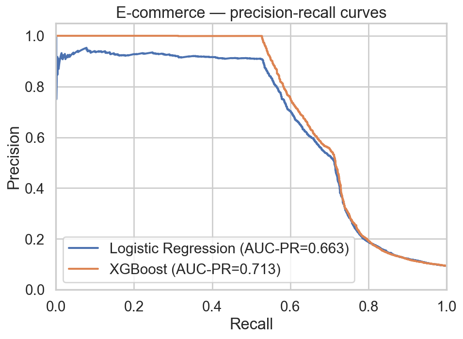

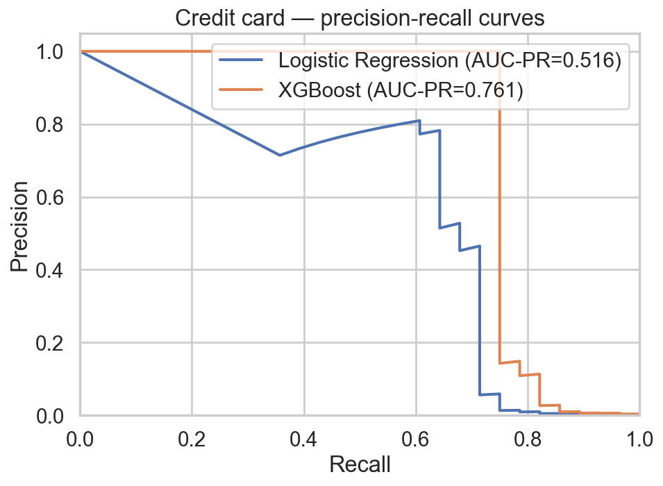

### Model selection

**XGBoost wins on both streams** — higher AUC-PR, higher F1, and drastically fewer false positives. It remains fully explainable through SHAP's `TreeExplainer`, so we sacrifice nothing on the interpretability requirement that regulated financial ML demands.

---

## Part 3 — Opening the Black Box with SHAP

### What the model thinks matters

XGBoost's built-in importance gives a first view of the drivers:

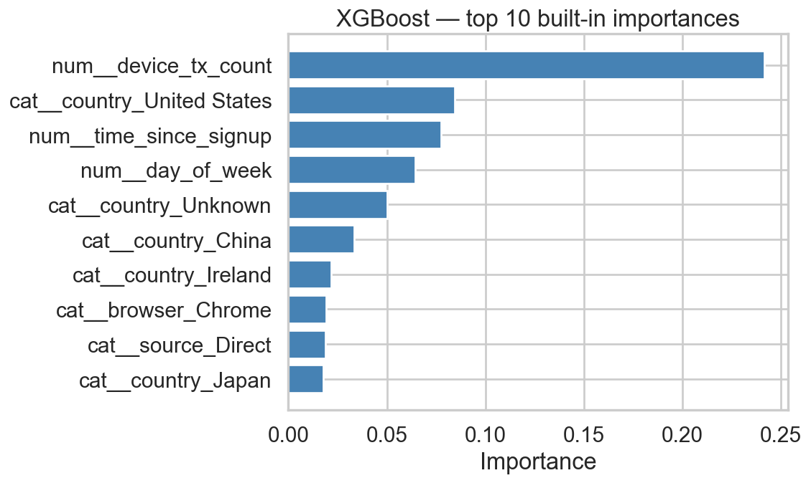

But built-in importance only counts how often features are used in tree splits. **SHAP values** attribute each individual prediction to its features — a stronger, prediction-level explanation suitable for audit and dispute processes.

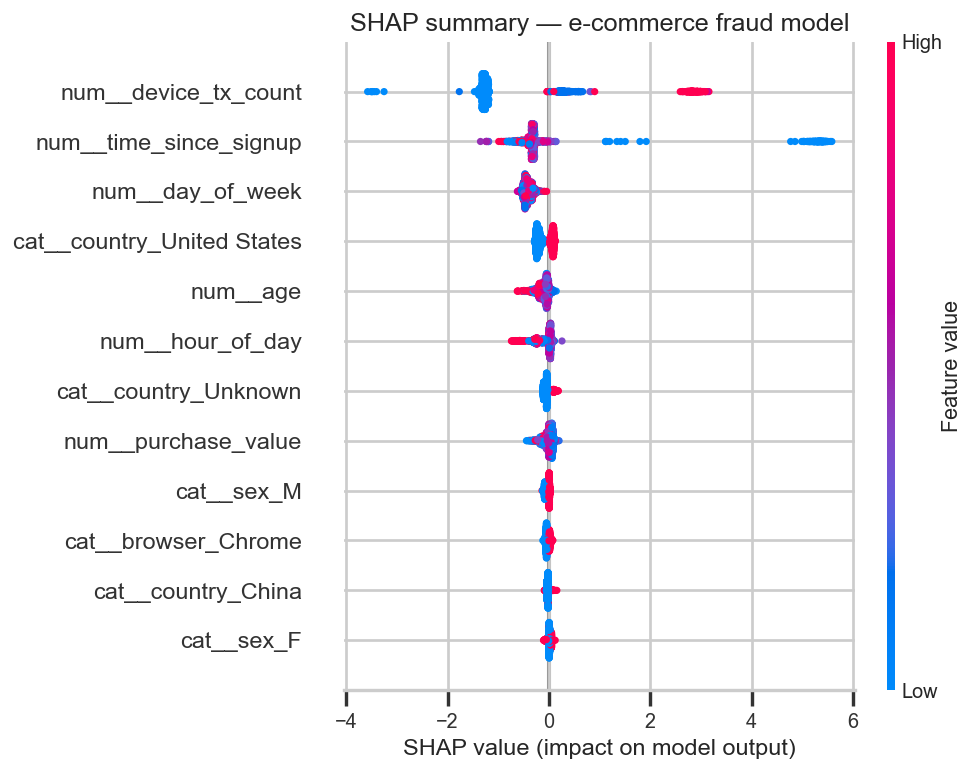

*Each dot is one transaction. Position shows how much the feature pushed the prediction toward fraud (right) or legitimate (left); color shows the feature's value (red = high).*

### Top 5 fraud drivers (mean |SHAP|)

| Rank | Feature | Mean \|SHAP\| | Interpretation |
|---|---|---|---|
| 1 | `device_tx_count` | 1.29 | Many transactions from one device screams device farming |
| 2 | `time_since_signup` | 0.61 | **Low** values (purchase right after signup) push toward fraud |
| 3 | `day_of_week` | 0.42 | Fraud concentrates on specific weekdays |
| 4 | `country_United States` | 0.16 | Geographic origin shifts baseline risk |
| 5 | `age` | 0.11 | Certain age brackets carry mild extra risk |

**The surprise:** `purchase_value` — the feature most people assume dominates fraud detection — barely registers. Fraudsters keep amounts unremarkable precisely to avoid amount-based rules. *Behavior (device reuse, purchase immediacy) beats amount.* This is exactly the kind of counterintuitive finding SHAP surfaces and a rules-based system would miss.

### Individual predictions: TP, FP, FN

Force plots explain single decisions — essential for analyst review queues and customer disputes.

**True positive — fraud, correctly caught.** High device transaction count and near-zero time-since-signup jointly push the score far above the base rate:

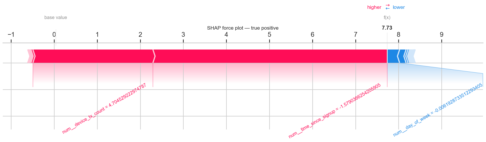

**False positive — legitimate customer flagged.** The model over-weighted a shared device (think: family tablet or corporate machine). This is the customer-trust failure mode to engineer around:

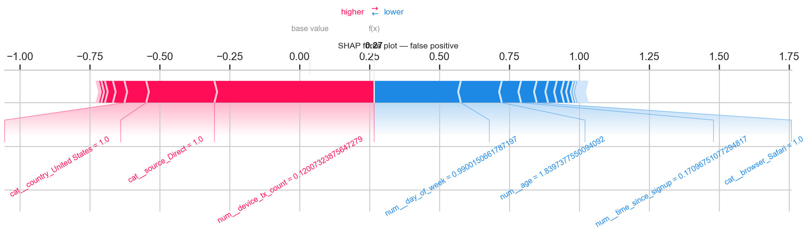

**False negative — fraud missed.** The transaction looked behaviorally normal: aged account, unremarkable device history. Patient fraudsters who "age" accounts evade signup-timing signals:

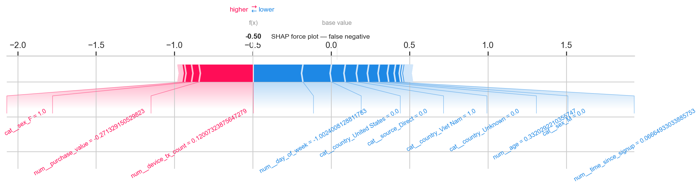

---

## Business Recommendations

Each recommendation maps directly to a SHAP finding above.

**1. Step-up verification for purchases within 24 hours of signup.**
`time_since_signup` is the #2 global driver, and the density plot shows fraud massing at near-zero hours. Requiring OTP or 3-D Secure for first-day purchases adds friction only where risk concentrates — the vast majority of legitimate customers purchase later and never see it.

**2. Device-level velocity throttling with soft review, not hard blocks.**
`device_tx_count` is the #1 driver, but our false-positive case shows shared devices can burn legitimate customers. Throttle high-velocity devices into a manual-review or challenge queue instead of auto-declining — this captures the driver's signal while containing the false-positive cost.

**3. Run two thresholds, not one.**
XGBoost's precision-recall trade-off (94% precision at 54% recall on e-commerce) argues for a dual-threshold policy: a high threshold for automatic declines (protecting customer experience) and a lower threshold that routes to lightweight challenges or monitoring (recovering the false negatives that a single conservative threshold misses).

**4. Feed country risk into a rules layer, not just the model.**
Country features contribute steady SHAP signal. Encoding high-risk origins as adjustable rules (lower transaction limits, extra KYC) lets the risk team react to geographic fraud waves faster than a model retrain cycle.

**5. Monitor for "aged-account" fraud.**
Our false-negative analysis shows the model's blind spot: fraudsters with patient, normal-looking accounts. Complement the model with periodic account-level anomaly review (sudden category shifts, dormancy followed by bursts) that doesn't depend on signup timing.

---

## Wrapping Up

| Metric | E-commerce | Credit card |
|---|---|---|
| Best model | XGBoost | XGBoost |
| AUC-PR | 0.713 | 0.761 |
| F1 | 0.686 | 0.778 |
| Precision | 0.941 | 0.808 |
| Key lever | Behavioral + geo features | PCA features + SMOTE |

Three lessons stand out:

1. **Feature engineering beats model complexity.** `time_since_signup` and `device_tx_count` — two engineered columns — carry more signal than any raw field, including the purchase amount everyone expects to matter.
2. **Imbalance discipline is non-negotiable.** SMOTE on the training set only, stratified splits, and PR-based metrics are what make the reported numbers trustworthy.
3. **Explainability is a product feature, not a compliance checkbox.** SHAP didn't just validate the model — it diagnosed the false-positive mechanism (shared devices) and the false-negative blind spot (aged accounts), and both became concrete operational recommendations.

*The full codebase — tested `src/` modules, notebooks, and CI — is available in the [project repository](https://github.com/Medi-unique/fraud-detection).*
